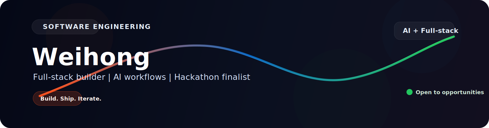

  

  <h1>Hi, I'm Weihong</h1>
  <h3>Y2 Software Engineering @ Universiti Malaya</h3>

  

    I build full-stack products, integrate AI into practical workflows, and enjoy turning ambitious ideas into systems people can actually use.
  

  

    
    
    
  

  

    
    
    
  

---

## Featured Highlights

<table>
  <tr>
    <td width="33%" valign="top">
      <strong>AI + Full-Stack</strong> 
      I like building products where the frontend, backend, data, and AI all work together.
    </td>
    <td width="33%" valign="top">
      <strong>Hackathon Ready</strong> 
      I move quickly, ship under pressure, and turn ideas into polished demos and working systems.
    </td>
    <td width="33%" valign="top">
      <strong>Product Mindset</strong> 
      I care about usefulness, clarity, and the end user experience, not just implementation.
    </td>
  </tr>
</table>

## Visual Stack

  
  
  
  
  
  

  

## About Me

I am a software engineering student with a strong interest in building intelligent systems that solve real-world problems.
I enjoy developing full-stack applications and integrating AI into practical workflows that improve decision-making, automation, and user experience.

## Focus Areas

- Full-stack product development
- AI integration and agentic workflows
- Practical systems for business and operations
- Shipping clean, useful, and reliable software

## Quick Snapshot

| Field | Details |
| --- | --- |
| `Name` | Weihong |
| `Degree` | Y2 Software Engineering |
| `University` | Universiti Malaya |
| `Interests` | Full-stack systems, AI workflows, hackathons, product building |

## Tech Stack

### Full Stack Development

- Frontend:
  
  
  

- Backend:
  
  

- Database:
  
  
  
  

### AI Integration

### Programming

## Hackathon Experience

  

<table>
  <thead>
    <tr>
      <th>Position</th>
      <th>Hackathon</th>
      <th>Year</th>
      <th>Description</th>
      <th>Link</th>
    </tr>
  </thead>
  <tbody>
    <tr>
      <td>Top 42 Semi-final</td>
      <td>Deriv AI Hackathon</td>
      <td>2026</td>
      <td>Built Zero HR, an end-to-end autonomous HR platform combining role-based access control, a Claude + ChromaDB + RAG chatbot grounded in company policies, and streamlined workflows for leave, contracts, compliance, performance tracking, messaging, and organization-wide analytics.</td>
      <td><a href="https://github.com/Dave0321/ZeroHR.git">View Project</a></td>
    </tr>
    <tr>
      <td>Participants</td>
      <td>TNG Digital FinHack</td>
      <td>2026</td>
      <td>Developed Dual Mind, an AWS-based AI red-team platform for AML detection that automates adversarial scenario generation, defender scoring, and retraining workflows to improve fraud detection.</td>
      <td><a href="https://github.com/Dave0321/DualMind.git">View Project</a></td>
    </tr>
    <tr>
      <td>Top 20 Finalist</td>
      <td>UM Hack</td>
      <td>2026</td>
      <td>Built GrantHunter, a full-stack Next.js + FastAPI AI grant copilot for Malaysian SMEs that uses a multi-agent pipeline to extract company profiles, scout and rank grant opportunities, score readiness, and generate submission-ready proposals, pitch decks, and packaged documents.</td>
      <td><a href="https://github.com/Dave0321/GrantHunter.git">View Project</a></td>
    </tr>
    <tr>
      <td>Participants</td>
      <td>KitaHack Google</td>
      <td>2026</td>
      <td>Built NextGenDebate, an AI-driven hiring platform with candidate screening, automated interview generation, and evaluation insights to support better recruitment decisions.</td>
      <td><a href="https://github.com/Dave0321/NextGenDebate.git">View Project</a></td>
    </tr>
    <tr>
      <td>Participants</td>
      <td>codeNection</td>
      <td>2025</td>
      <td>Built EasyClaim, a digital-first car insurance platform for the CodeNection Hackathon that combines real-time typo detection for vehicle details, secure decentralized insurance data storage, and AI-powered vehicle damage assessment from accident photos.</td>
      <td><a href="https://github.com/Dave0321/EasyClaim.git">View Project</a></td>
    </tr>
  </tbody>
</table>

## Projects

  

### MergeAid
<table>
  <tr>
    <td width="68%" valign="top">
      <ul>
        <li>Built an Android emergency support app for reporting SOS situations, tracking nearby incidents on a live map, and staying connected through a community feed</li>
        <li>Integrated location tracking, realtime alerts, emergency routing, user profiles, and favorites into a fast mobile-first experience</li>
        <li>Designed the app around practical safety use cases with Supabase-backed auth, storage, and realtime incident updates</li>
      </ul>
    </td>
    <td width="32%" valign="top">
      <strong>Stack</strong> 
      <code>Android</code> 
      <code>Java</code> 
      <code>Kotlin</code> 
      <code>Supabase</code>
    </td>
  </tr>
</table>

## Contact

  

  If you'd like to connect about opportunities, projects, or ideas, reach me here:

<table>
  <tr>
    <td width="33%" align="center" valign="top">
      <strong>LinkedIn</strong> 
       
      Best for recruiting, networking, and professional updates.
    </td>
    <td width="33%" align="center" valign="top">
      <strong>Email</strong> 
       
      Best for direct opportunities and project discussions.
    </td>
    <td width="33%" align="center" valign="top">
      <strong>Portfolio</strong> 
       
      Best for a quick look at projects and live demos.
    </td>
  </tr>
</table>

---

  <strong>Open to opportunities where I can build impactful products with speed, quality, and ownership.</strong>

